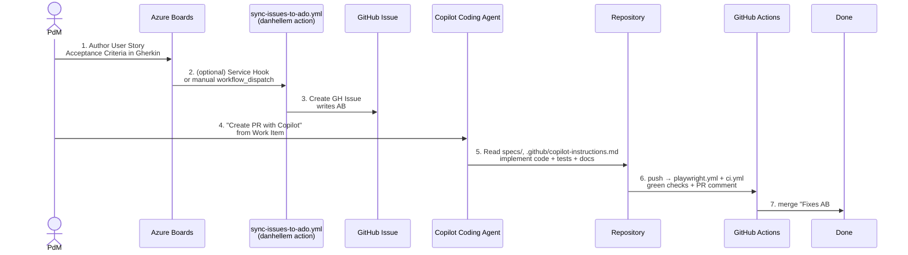

# ③ Spec-driven development (Azure Boards × GitHub × spec-kit) / 仕様駆動開発

## The 7-step flow / 7 ステップフロー



## What this repo demonstrates

| Step | File / Mechanism |
|---|---|
| Spec format | `specs/001-login-feature/spec.md` — User Story + Gherkin AC + FR-NNN + SC-NNN + `[NEEDS CLARIFICATION]` |
| Spec → tasks | `specs/001-login-feature/tasks.md` — `[P]` markers for parallel-safe tasks |
| Issue template | `.github/ISSUE_TEMPLATE/user-story.yml` — same shape as the spec |
| Boards link | `AB#<id>` syntax (any commit / PR body) — see also `.github/pull_request_template.md` |
| ADO sync | `.github/workflows/sync-issues-to-ado.yml` — workflow_dispatch only, gated on `ENTRA_APP_CLIENT_ID` |
| Test mapping | `app/frontend/tests/e2e/login.spec.ts` — each `test()` title starts with `AC-NNN:` |
| Conventions for AI | `.github/copilot-instructions.md` + `AGENTS.md` |

## Why hand-craft `specs/001-login-feature/` instead of running `specify init`?

For a 30-minute live demo, taking a dependency on `uv tool install specify-cli` adds network and time risk. The hand-crafted artifacts in `specs/` follow the exact same format `specify` would generate.

To adopt the real CLI:

```bash
uv tool install specify-cli --from git+https://github.com/github/spec-kit.git@vX.Y.Z
specify init --integration copilot
# then in Copilot Chat:
/speckit.constitution
/speckit.specify "Login feature ..."
/speckit.clarify
/speckit.plan
/speckit.tasks
/speckit.implement
```

The 8 slash commands are documented in `github/spec-kit` README; the artifacts they produce drop into the same `specs/<NNN>-<slug>/` layout we used.

## Why is `sync-issues-to-ado.yml` `workflow_dispatch` only?

Without a real Entra ID app + ADO organization configured, the danhellem action would fail and turn the CI dashboard red — exactly the smell a dev lead would call out. The `preflight` job in the workflow checks for `ENTRA_APP_CLIENT_ID` + `ADO_ORGANIZATION` and short-circuits cleanly with a Job Summary explanation if they are missing.

To enable real sync, an operator:

1. Creates an Entra ID app registration; configures a Federated Credential whose `subject` is `repo:<org>/<repo>:environment:<env>`.
2. Grants the SP **Basic** access to the Azure DevOps organization.
3. Sets the GitHub secrets `ENTRA_APP_CLIENT_ID`, `ENTRA_APP_TENANT_ID`, `GH_PERSONAL_ACCESS_TOKEN`, and the variables `ADO_ORGANIZATION`, `ADO_PROJECT`.
4. Optionally adds an ADO Service Hook to call `gh workflow run sync-issues-to-ado.yml --field issue_number=<n>` so the manual trigger becomes automatic.

## Anti-patterns called out / 避けるべき書き方

| ❌ Don't | ✅ Do |
|---|---|
| `test('login works')` | `test('AC-001: valid credentials redirect to dashboard')` |
| Acceptance Criteria as bullet points without scenario shape | Gherkin: `Given … When … Then …` |
| "User wants login" | `As a returning user / I want / So that` |
| Inventing missing details silently | `[NEEDS CLARIFICATION: ...]` and stop |
| `git commit -m "fix login"` | `git commit -m "fix: handle empty password on login form AB#1042"` |
