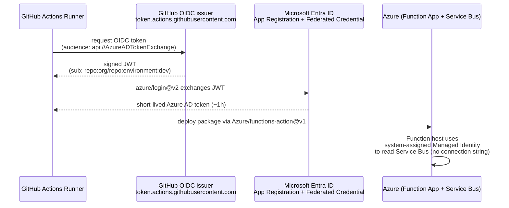

# Architecture

> 🇯🇵 Japanese version: [`docs/ja/architecture.md`](../ja/architecture.md)

## End-to-end flow

> The flow ties together the 5 topics: spec written by the PdM → AI implements with context files → Playwright E2E in CI → OIDC deploy to Azure → Work Item closes via `AB#`.

```mermaid
flowchart TB
    PdM[👤 PdM<br/>Azure Boards Work Item<br/>Acceptance Criteria<br/>Given/When/Then]
    GH[GitHub Issue<br/>created from template<br/>contains AB#XXX]
    SPEC[specs/NNN-feature/<br/>spec.md / plan.md / tasks.md]
    INST[".github/copilot-instructions.md<br/>+ AGENTS.md<br/>+ .github/instructions/*"]
    CA[Copilot Coding Agent<br/>or local Copilot Chat]
    MCPpw[Playwright MCP<br/>browser_snapshot<br/>browser_generate_locator]
    REPO[(Repository<br/>code + tests + workflows)]
    CI[GitHub Actions<br/>ci.yml + playwright.yml]
    PRC[PR comment, Job Summary<br/>HTML report artifact]
    OIDC[Federated Credential<br/>repo:org/repo:environment:&lt;env&gt;]
    AZ[Azure<br/>Functions + Service Bus<br/>Managed Identity]
    DONE[Work Item Done<br/>via fixes AB#XXX]

    PdM --> GH
    PdM --> SPEC
    SPEC --> CA
    INST --> CA
    GH --> CA
    CA <--> MCPpw
    CA --> REPO
    REPO --> CI
    CI --> PRC
    CI -.->|workflow_dispatch only| OIDC
    OIDC -.-> AZ
    REPO -- merge "fixes AB#" --> DONE
```

## Repo layout

```
dev-demo/
├── README.md (English) + README.ja.md (Japanese)
├── AGENTS.md
├── LICENSE, CODEOWNERS, .editorconfig, .gitignore
├── .github/
│   ├── copilot-instructions.md          # Topic ④
│   ├── instructions/                    # path-scoped overrides
│   ├── ISSUE_TEMPLATE/user-story.yml    # Topic ③
│   ├── dependabot.yml, pull_request_template.md
│   └── workflows/
│       ├── ci.yml                       # always-green: pytest + bicep build
│       ├── playwright.yml               # Topic ① sharded + merge-reports
│       ├── deploy-function-app.yml      # Topic ⑤ reusable (workflow_call only)
│       ├── deploy-caller.yml            # Topic ⑤ caller (workflow_dispatch + dry-run default)
│       └── sync-issues-to-ado.yml       # Topic ③ Boards sync (on: issues:)
├── .vscode/
│   ├── mcp.json                         # Topic ② Playwright + GitHub MCP
│   └── settings.json
├── specs/001-login-feature/             # Topic ③ spec-kit artifacts
│   ├── spec.md (Gherkin)
│   ├── plan.md
│   └── tasks.md
├── app/
│   ├── frontend/                        # Topic ① Vite + vanilla TS target app
│   │   ├── src/{main.ts, auth.ts, style.css}
│   │   ├── tests/e2e/{login,dashboard}.spec.ts
│   │   └── playwright.config.ts (with webServer:)
│   └── functions/                       # Topic ⑤ Python Functions v2
│       ├── function_app.py (thin wrapper)
│       ├── processing.py (pure logic)
│       └── tests/test_processing.py
├── infra/bicep/                         # Topic ⑤ IaC
│   ├── main.bicep
│   └── modules/{servicebus, functionapp, sb-role-runtime}.bicep
├── scripts/                             # setup-oidc, run-playwright, validate-bicep, …
└── docs/
    ├── en/  (English versions of the narratives + tour script)
    └── ja/  (Japanese versions of the same content)
```

## Topic ↔ file map

| Topic | Primary files |
|---|---|
| ① Playwright E2E | `app/frontend/playwright.config.ts`, `tests/e2e/*.spec.ts`, `.github/workflows/playwright.yml` |
| ② MCP test maintenance | `.vscode/mcp.json`, `docs/en/02-mcp-test-maintenance.md` |
| ③ Boards × spec-kit | `specs/001-login-feature/*`, `.github/ISSUE_TEMPLATE/user-story.yml`, `.github/workflows/sync-issues-to-ado.yml` |
| ④ AI context | `.github/copilot-instructions.md`, `AGENTS.md`, `.github/instructions/*.instructions.md` |
| ⑤ Azure CD | `infra/bicep/*.bicep`, `.github/workflows/deploy-{function-app,caller}.yml`, `scripts/setup-oidc.sh`, `app/functions/*` |

## Topic ⑤ — OIDC trust chain in detail


