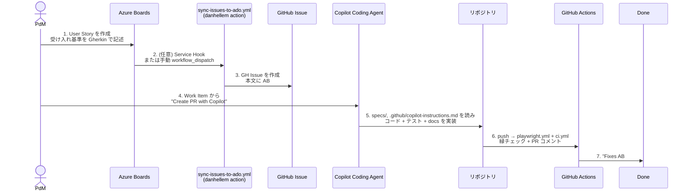

# ③ 仕様駆動開発 (Azure Boards × GitHub × spec-kit)

> 🇬🇧 English version: [`docs/en/03-spec-driven-dev.md`](../en/03-spec-driven-dev.md)

## 7 ステップフロー



## このリポジトリで示すもの

| ステップ | ファイルまたは仕組み |
|---|---|
| Spec フォーマット | `specs/001-login-feature/spec.md` — User Story + Gherkin AC + FR-NNN + SC-NNN + `[NEEDS CLARIFICATION]` |
| Spec → タスク | `specs/001-login-feature/tasks.md` — `[P]` マーカーで並列実行可能 |
| Issue テンプレート | `.github/ISSUE_TEMPLATE/user-story.yml` — spec と同じ形 |
| Boards リンク | `AB#<id>` 構文 (コミットまたは PR 本文) — `.github/pull_request_template.md` も参照 |
| ADO 同期 | `.github/workflows/sync-issues-to-ado.yml` — `issues:` イベントで起動; `ENTRA_APP_CLIENT_ID` でゲート |
| テストとの対応付け | `app/frontend/tests/e2e/login.spec.ts` — 各 `test()` タイトルが `AC-NNN:` で始まる |
| AI 向け規約 | `.github/copilot-instructions.md` + `AGENTS.md` |

## なぜ `specify init` を実行せず `specs/001-login-feature/` を手で書いたか

30 分のライブデモにとって、`uv tool install specify-cli` への依存はネットワークと時間のリスクを増やす。手書きの `specs/` 成果物は `specify` が生成するのと完全に同じフォーマット。

実 CLI を採用するには:

```bash
uv tool install specify-cli --from git+https://github.com/github/spec-kit.git@vX.Y.Z
specify init --integration copilot
# その後 Copilot Chat で:
/speckit.constitution
/speckit.specify "Login feature ..."
/speckit.clarify
/speckit.plan
/speckit.tasks
/speckit.implement
```

8 つのスラッシュコマンドは `github/spec-kit` README に記載。生成される成果物は今回採用した `specs/<NNN>-<slug>/` レイアウトに落ちる。

## なぜ `sync-issues-to-ado.yml` をゲートしているか

実 Entra ID app + ADO 組織が無いと danhellem action が失敗し、CI ダッシュボードが赤くなる — 開発リーダーが真っ先に指摘する匂い。ワークフローの `preflight` ジョブが `ENTRA_APP_CLIENT_ID` / `ENTRA_APP_TENANT_ID` / `ADO_ORGANIZATION` / `ADO_PROJECT` / `GH_PERSONAL_ACCESS_TOKEN` をチェックし、欠けていたら Job Summary で説明して綺麗に short-circuit する。

実際に同期を有効化する手順:

1. Entra ID app registration を作成し、Federated Credential を `subject: repo:<org>/<repo>:ref:refs/heads/main` で追加 (このワークフローは `environment:` を持たないので、Environment スコープの subject は適用されない)。
2. Azure DevOps 組織に Service Principal をユーザーとして追加 (`serviceprincipalentitlements` API 経由) し、Contributors アクセスを付与。
3. GitHub repo secrets に `ENTRA_APP_CLIENT_ID`, `ENTRA_APP_TENANT_ID`, `GH_PERSONAL_ACCESS_TOKEN` を、variables に `ADO_ORGANIZATION`, `ADO_PROJECT` を設定。Scrum process 以外なら `ADO_WORK_ITEM_TYPE` / `ADO_NEW_STATE` / `ADO_ACTIVE_STATE` / `ADO_CLOSE_STATE` を上書きする。

その後はワークフローが全 issue イベント (opened / edited / labeled / closed) で自動実行。手動再同期したいときは `manual-sync` ジョブがラベル付与・解除を 1 セットすることで `issues:labeled` を発火させる。

## アンチパターン

| ❌ ダメ | ✅ 推奨 |
|---|---|
| `test('login works')` | `test('AC-001: valid credentials redirect to dashboard')` |
| 受け入れ基準を箇条書きだけで書く | Gherkin: `Given … When … Then …` |
| 「ユーザーがログインしたい」 | `As a returning user / I want / So that` |
| 欠けた詳細を黙って創作する | `[NEEDS CLARIFICATION: ...]` を書いて止まる |
| `git commit -m "fix login"` | `git commit -m "fix: handle empty password on login form AB#1042"` |
