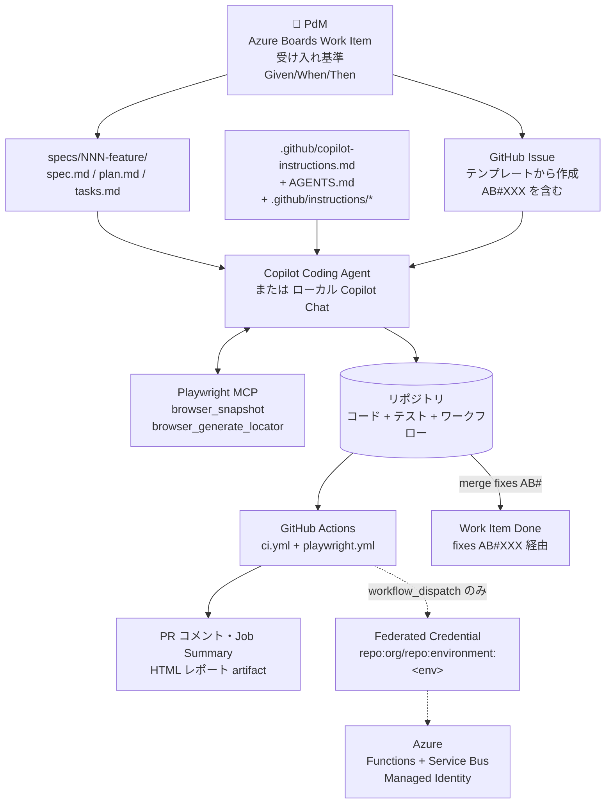
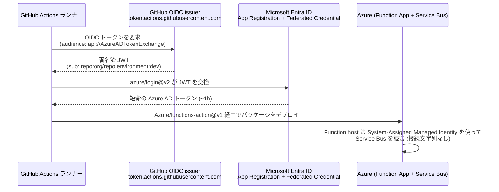

# アーキテクチャ

> 🇬🇧 English version: [`docs/en/architecture.md`](../en/architecture.md)

## End-to-end フロー

> このフローは 5 領域を 1 本につなぐ: PdM が仕様を書く → AI がコンテキストファイルを参照しつつ実装 → CI で Playwright E2E → OIDC で Azure に deploy → `AB#` で Work Item クローズ。



## リポジトリ構成

```
dev-demo/
├── README.md (英語) + README.ja.md (日本語)
├── AGENTS.md
├── LICENSE, CODEOWNERS, .editorconfig, .gitignore
├── .github/
│   ├── copilot-instructions.md          # 領域 ④
│   ├── instructions/                    # パス指定の上書き
│   ├── ISSUE_TEMPLATE/user-story.yml    # 領域 ③
│   ├── dependabot.yml, pull_request_template.md
│   └── workflows/
│       ├── ci.yml                       # 常時グリーン: pytest + bicep build
│       ├── playwright.yml               # 領域 ① シャード + merge-reports
│       ├── deploy-function-app.yml      # 領域 ⑤ reusable (workflow_call のみ)
│       ├── deploy-caller.yml            # 領域 ⑤ caller (workflow_dispatch + dry-run 既定)
│       └── sync-issues-to-ado.yml       # 領域 ③ Boards 同期 (on: issues:)
├── .vscode/
│   ├── mcp.json                         # 領域 ② Playwright + GitHub MCP
│   └── settings.json
├── specs/001-login-feature/             # 領域 ③ spec-kit 成果物
│   ├── spec.md (Gherkin)
│   ├── plan.md
│   └── tasks.md
├── app/
│   ├── frontend/                        # 領域 ① Vite + vanilla TS の対象アプリ
│   │   ├── src/{main.ts, auth.ts, style.css}
│   │   ├── tests/e2e/{login,dashboard}.spec.ts
│   │   └── playwright.config.ts (webServer: 付き)
│   └── functions/                       # 領域 ⑤ Python Functions v2
│       ├── function_app.py (薄いラッパー)
│       ├── processing.py (pure ロジック)
│       └── tests/test_processing.py
├── infra/bicep/                         # 領域 ⑤ IaC
│   ├── main.bicep
│   └── modules/{servicebus, functionapp, sb-role-runtime}.bicep
├── scripts/                             # setup-oidc, run-playwright, validate-bicep, …
└── docs/
    ├── en/  (各章 + ツアー台本の英語版)
    └── ja/  (同じ内容の日本語版)
```

## 領域 ↔ ファイル対応

| 領域 | 主要ファイル |
|---|---|
| ① Playwright E2E | `app/frontend/playwright.config.ts`, `tests/e2e/*.spec.ts`, `.github/workflows/playwright.yml` |
| ② MCP テスト保守 | `.vscode/mcp.json`, `docs/ja/02-mcp-test-maintenance.md` |
| ③ Boards × spec-kit | `specs/001-login-feature/*`, `.github/ISSUE_TEMPLATE/user-story.yml`, `.github/workflows/sync-issues-to-ado.yml` |
| ④ AI コンテキスト | `.github/copilot-instructions.md`, `AGENTS.md`, `.github/instructions/*.instructions.md` |
| ⑤ Azure CD | `infra/bicep/*.bicep`, `.github/workflows/deploy-{function-app,caller}.yml`, `scripts/setup-oidc.sh`, `app/functions/*` |

## 領域 ⑤ — OIDC 信頼関係の詳細


